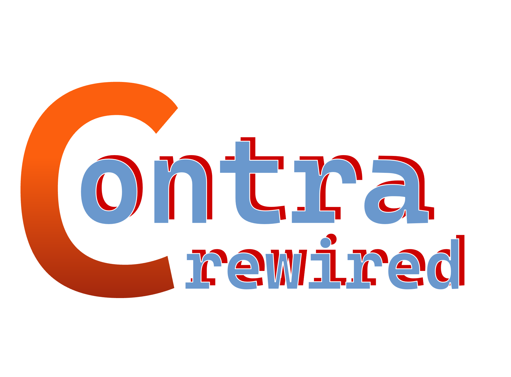

<p align="center">
  
</p>

A from-scratch Rust engine for a PC (and eventually Android) port of
*Contra* (NES, 1988) - built to the "definitive port" brief: **the original
game, unmodified by default, with every modern convenience available as an
opt-in layer instead of a replacement.**

> **Status: playable, with your own ROM.** `contra-pc` runs a real,
> from-scratch NES emulation core (`crates/contra-nes`: 6502 CPU, 2C02 PPU,
> mapper 2/UxROM) - point it at your own legally-dumped Contra ROM and it
> plays the actual game, not a reimplementation of it. Verified against a
> real US retail ROM: title screen, stage intro, and in-level gameplay
> (player, enemies, item drops) all render correctly - see
> [docs/FIDELITY.md](docs/FIDELITY.md) for exactly what was checked. It has
> real audio (pulse/triangle/noise synthesis via `cpal`; DMC is the one
> channel still missing), a freely resizable window that fills whatever
> shape it's dragged to, true-ultrawide widescreen that tracks your monitor
> and remembers already-explored terrain (not just a wider fixed box - see
> [Controls](#controls)), an opt-in "no sprite flicker" mode, a mouse-driven
> `egui` pause menu with live RAM-based cheats/trainer tooling for both
> players, and working Lua mod scripting (see `mods/rgb-character/` for a
> real, running example). See [Project status](#project-status) and
> [ROADMAP.md](ROADMAP.md) for exactly what's real today versus planned.

## Why an emulator core, not a hand-ported reimplementation

Contra's NES code is about 11,000 lines of 6502 across 8 banks - every
enemy, every boss, every weapon, every piece of level data. Hand-porting all
of that to Rust routine-by-routine, faithfully, would take months, and there
would be no way to verify the result against the real game without... the
real game. So instead: `contra-nes` emulates the hardware (CPU, PPU, the
mapper Contra uses) accurately enough to run the *original, unmodified
6502 code* directly. That gets bit-exact physics, RNG, hitboxes, and quirks
**for free** - because it's literally Konami's code running, not a guess at
what it did. This is also the only way "Original NES mode replicates even
bugs/quirks" (from the original brief) is actually achievable.

`crates/contra-core` (the hand-ported physics/RNG/config/save-state layer
from earlier in this project) is still here and still useful - for
documentation, as a reference for RAM-address-based tooling (Custom
Difficulty, Practice mode overlays, trainers) that pokes the *emulator's*
memory using the address map the community disassembly documents, the same
way real "enhanced ports" of old console games are usually built, and as
the save-state format `contra-pc` falls back to before any ROM is loaded.

## Design principle

> Don't touch what makes Contra *Contra*. Put everything else behind a flag.

Concretely: an `Original` mode that boots straight into the unmodified game
with no menus in the way, and every other system - widescreen, save states,
randomizers, roguelike mode, online co-op, a level editor - built as opt-in
layers that never change how `Original` plays. `contra_core::config::Config`
enforces this today: `hardcore_mode` and `original_nes_mode` are hard
overrides that force every convenience feature off, not just defaults.

## The legal model: bring your own ROM

**This repository contains zero Konami-owned assets** - no graphics, no
audio, no level data, no ROM. `contra-nes` doesn't ship or embed a copy of
the game; it's a general-purpose NES emulation core that runs whatever ROM
you give it. You supply your own legally-dumped copy of the game
(`baserom.nes`), and `contra-pc` reads *your* file at run time on *your*
machine. See [docs/ASSETS.md](docs/ASSETS.md) for details.

## How to play (if you own the ROM)

```sh
cargo run -p contra-pc --release -- path\to\your\baserom.nes
```

Or drop a `baserom.nes` next to the executable and just run `contra-pc` -
it's picked up automatically. Without a ROM, or with a ROM using a mapper
other than 2 (UxROM), it shows a real Load ROM screen instead of failing
outright: click "LOAD ROM..." for a native file picker, or drag and drop a
`.nes` file onto the window - no CLI required.

## Project status

| Area | Status |
|---|---|
| **NES emulation core** (`contra-nes`) | |
| 6502/2A03 CPU | All official opcodes, incl. the JMP-indirect page-boundary bug; 21 unit tests against hand-assembled programs - see `crates/contra-nes/src/cpu.rs` |
| 2C02 PPU | Background + sprites, scrolling, sprite 0 hit, mapper-CHR-RAM, opt-in "Extended" true-ultrawide widescreen (tracks the monitor's live aspect ratio, already-explored terrain remembered and redrawn via `Ppu::tile_cache`, fixed-centered so the player's on-screen position never shifts) and unlimited-sprites presentation modes - **scanline-granular, not per-dot** (see [docs/FIDELITY.md](docs/FIDELITY.md)) |
| Mapper 2 (UxROM) | Implemented - PRG bank switching, CHR-RAM |
| APU | Pulse 1/2, triangle, noise, frame sequencer, real-time playback via `cpal` - **DMC (sample playback) not implemented** |
| Controller input | Implemented (standard shift-register protocol) |
| Save states | Full emulator snapshots (CPU+RAM+PPU+APU), excluding the static PRG-ROM - real quick save/load/rewind wired in `contra-pc` |
| **Hand-ported simulation layer** (`contra-core`) | |
| Fixed-point vertical physics, walk/jump velocity | Ported from the disassembly, used as the save-state fallback before a ROM is loaded and as a RAM-tooling reference - see FIDELITY.md |
| Config (video/audio/input/gameplay/accessibility/practice) | Full schema, round-trips through `config.toml` |
| Rebindable input, hold/toggle fire | Implemented; keyboard **and gamepad** (`gilrs`) both wired in `contra-pc` |
| Difficulty presets + Custom Difficulty + shareable codes | Implemented, tested |
| Replay format (input log, "Take Control" handoff) | Format implemented; no recording/playback loop yet |
| **Everything else** | |
| ROM loading + identity check | Implemented (`contra-assets`) |
| Mod manifest, registry, Lua host | **Working end-to-end**: `contra-pc --features mods` loads scripts from `./mods/` and applies their PPU writes live every frame - see `mods/rgb-character/` and docs/MODDING.md |
| Menu / UI | Built on `egui` + `wgpu` (mouse-driven pause menu with Settings/Mods/Debug tabs, real Load ROM screen with native file picker + drag-and-drop) - see "Controls" above |
| Level editor, randomizer, netcode, roguelike, etc. | Not started - see ROADMAP.md |

See [ROADMAP.md](ROADMAP.md) for the full three-phase plan, with every item
tagged by what's actually done versus planned.

## Building

Requires the Rust toolchain (`rustup`, stable channel).

```sh
git clone https://github.com/uesleibros/contra-rewired.git
cd contra-rewired
cargo build --workspace
cargo test --workspace
```

64 tests, all green, no ROM or window required - the emulator core is
validated with small original hand-assembled 6502 programs (see
`crates/contra-nes/src/cpu.rs` and `nes.rs`), not against Contra itself.

Validate a ROM without launching the window:

```sh
cargo run -p contra-extract -- path\to\your\baserom.nes
```

Lua mod scripting is off by default and needs a C toolchain (MSVC Build
Tools on Windows, `gcc`/`clang` elsewhere) because `mlua`'s vendored build
compiles Lua from source:

```sh
cargo build -p contra-pc --release --features mods
```

See [docs/MODDING.md](docs/MODDING.md) for the Windows MSVC-environment
setup if `cl.exe` isn't already on `PATH`, and for the full scripting API -
`mods/rgb-character/` in this repo is a complete, working example mod.

## Controls

| Action | Keyboard | Gamepad |
|---|---|---|
| Move | Arrow keys | D-pad or left stick |
| Jump (A) | X | East face button (B/Circle) |
| Shoot (B) | Z | South face button (A/Cross) |
| Start / Select | Enter / Right Shift | Start / Select |
| Pause / menu | Escape or Tab | Start |
| Quick save / load | F5 / F9 | - |
| Rewind | Backspace | - |
| Frame advance | F12 to freeze, `.` to step one frame | - |

Gamepad support is via [`gilrs`](https://docs.rs/gilrs) and works alongside
keyboard input; only the first connected controller is read today. Rewind
only does anything if `gameplay.rewind_enabled = true` in `config.toml`
(off by default, matching `Original` fidelity). Save states hold the whole
emulator's state - CPU, RAM, PPU, APU - captured without copying the
cartridge ROM each time (see `contra_nes::Nes::snapshot`/`restore`).
Fully rebindable via `contra_core::input::Bindings` - an in-game rebinding
UI isn't built yet; edit `config.toml` after first run, or see
`crates/contra-core/src/input.rs`.

**Settings hotkeys** - every toggle below also has a direct hotkey, so you
don't have to open the menu mid-fight:

| Hotkey | Toggles |
|---|---|
| F1 | Widescreen |
| F2 | No Sprite Flicker |
| F3 | Pixel Perfect |
| F4 | Hitbox overlay |
| F6 | Scanlines |
| F7 | Stats overlay |
| F8 | Mute audio |
| F11 | Fullscreen |
| F12 | Freeze (frame advance with `.`) |

**Window**: freely resizable, no fixed aspect ratio - drag it to any size
and the content fills it (fractional "dynamic fill" scaling by default; a
"Pixel Perfect" toggle switches to strict integer scaling with letterbox
bars instead, if you prefer crisp NES pixels over a perfect window fill).
Toggling Widescreen on resizes the window to your monitor's full width and
tracks it live from then on - true ultrawide, not just a wider fixed box.
Terrain the level has already shown (anything the camera has scrolled past)
is remembered and redrawn correctly no matter how far out you go; terrain
it hasn't shown yet renders as clean backdrop instead of a guess. See
docs/FIDELITY.md for exactly how that works and its one real limitation
(enemies/bullets still only appear the moment the original camera-relative
game logic would spawn them).

**Pause menu**: press Escape, Tab, or gamepad Start to open it - built on
[`egui`](https://github.com/emilk/egui) (real checkboxes, sliders, and
buttons, not a hand-rolled bitmap font), rendered via `wgpu` as a crisp
overlay at the window's native resolution, not blocky upscaled NES pixels.
Mouse-driven, and stays up while gameplay keeps rendering behind it. Three
tabs:

- **Settings** - Widescreen, No Sprite Flicker (lifts the real hardware's
  8-sprites-per-scanline limit, an accuracy break that's off by default so
  `Original` mode stays hardware-accurate), Pixel Perfect, Hitbox overlay
  (outlines every active sprite - the *visual* bounding box, see
  docs/FIDELITY.md for why it's not necessarily Contra's exact collision
  box), Scanlines, Stats overlay (frame count + both players' live X/Y),
  Zoom (50-300%), Speed (25-200%, real slow motion - the game still runs
  its own logic one real frame at a time, just paced differently),
  Fullscreen, Audio Mute.
- **Mods** - click to enable/disable any mod found in `./mods/`.
- **Debug** - live cheats for *both* players, backed by real CPU RAM pokes
  (not `contra-core`'s hand-ported layer - the actual running game's
  memory, using the address map the community disassembly documents; see
  docs/MODDING.md): lives, current weapon (dropdown), the "R" rapid-fire
  capsule powerup (independent of weapon, same as the real pickup), shared
  continues, and a stage select - click any of 6 of the 8 stages to jump
  straight there, instantly (the real level-load transition still runs in
  full, unmodified, it's just fast-forwarded silently in the background
  instead of shown to you - see docs/FIDELITY.md). Base 1 and Base 2 are
  disabled for now - jumping to them hangs the game, still unexplained
  even after reading the real disassembly, see docs/FIDELITY.md.

It's a small, honest v1, not a finished options screen - see ROADMAP.md for
what's still menu-less (CRT filter beyond scanlines, palette swaps,
in-game keybind remapping).

**No ROM loaded?** `contra-pc` shows a real Load ROM screen instead of a
placeholder demo - click "Load ROM..." for a native file picker, or drag
and drop a `.nes` file onto the window.

## Repository layout

```
crates/contra-nes/      NES emulation core: 6502 CPU, 2C02 PPU (incl. live
                         widescreen + unlimited-sprites presentation modes),
                         real APU, mapper 2/UxROM, controller
crates/contra-core/     hand-ported simulation: physics, RNG, config, input,
                         save states, replays, difficulty, checkpoints
crates/contra-assets/   legal ROM loading/validation
crates/contra-mods/     mod manifest/registry + working Lua host (`lua` feature)
apps/contra-pc/         desktop shell: wgpu + egui window/menu, input/audio,
                         loads a ROM into contra-nes (falling back to a real
                         Load ROM screen) and mods into contra-mods
apps/contra-pc/assets/  app icon (baked into the binary via include_bytes!)
apps/contra-extract/    ROM validation CLI
docs/                   architecture, fidelity notes, asset pipeline, modding
docs/assets/            README images
mods/                   drop mods here (gitignored) - see mods/rgb-character/
                         for a real, working example
```

## Contributing

The highest-value work right now is on the emulator core, since it's what
actually makes the game playable:

- **APU (audio)** - pulse/triangle/noise are real and playing; DMC (sample
  playback) is the one channel still missing.
- **PPU accuracy** - moving from scanline-granular to per-dot rendering for
  effects that change registers mid-scanline (rare, but real).
- **More mappers**, if you want other NES games to run on this core too.
- **RAM-address tooling** - lives/weapon/rapid-fire/continues pokes, stage
  select, and a stats overlay are real and working (Debug tab, see
  docs/MODDING.md); a full Custom Difficulty slider set (enemy speed/
  density/spawn-rate/damage multipliers) still needs a per-frame RAM-watch
  mechanism rather than one-time pokes - see docs/FIDELITY.md.

See [ROADMAP.md](ROADMAP.md) for the full list.

## Credits

- Original game: Konami, 1988. This project is an independent, unofficial
  fan engine; it is not affiliated with or endorsed by Konami.
- The NES hardware behavior `contra-nes` emulates (CPU opcodes, PPU
  registers, mapper 2) is publicly documented, freely-reimplementable
  console hardware behavior - see [nesdev.org](https://www.nesdev.org) - not
  Konami's game code. `contra-nes` contains no code or data from Contra or
  from any disassembly of it.
- Physics/RNG/ROM-structure facts referenced in `contra-core` and its docs
  were verified against
  [vermiceli/nes-contra-us](https://github.com/vermiceli/nes-contra-us), an
  annotated disassembly by the credited author(s), itself built on Trax's
  original disassembly for the *Revenge of the Red Falcon* project. No code
  or prose from that repository is reproduced here.

## License

MIT - see [LICENSE](LICENSE). Applies to the original code in this
repository only; it does not grant any rights to Konami's *Contra* itself,
and does not cover any ROM, asset, or mod file you supply or install
yourself.
